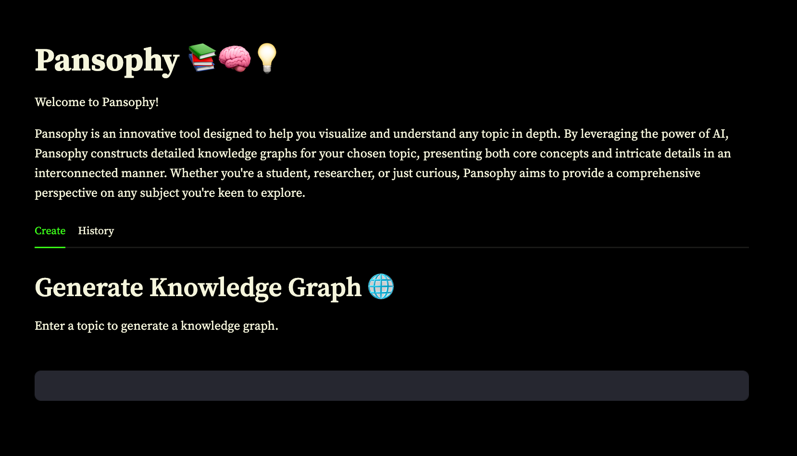
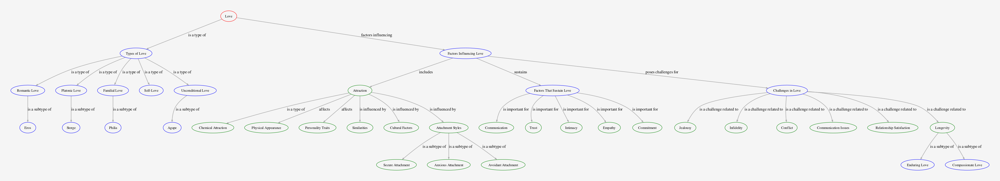

# Pansophy


Pansophy is an AI-powered knowledge visualization tool. Dive deep into any topic and get a comprehensive, interconnected perspective with detailed knowledge graphs.

[Devpost Link](https://devpost.com/software/pansophy)

## Inspiration

In today's information era, understanding and visualizing the vast amounts of knowledge available is crucial. Pansophy was inspired by the need for a tool that can represent complex information in an interconnected and easily digestible manner.

## Why Pansophy?

"Pansophy" is derived from the term "pansophism", which originates from two Greek words: "pan", meaning "all", and "sophia", meaning "wisdom". Pansophism is a philosophical concept that represents the idea of acquiring universal knowledge or wisdom.

## Tech Stack

- **Streamlit**: For the web application interface.
- **OpenAI**: The LLM models that generates the knowledge graphs.
- **instructor**: Structured extraction from openai function calls.
- **Graphviz & Pyvis**: Libraries for visualizing the knowledge graphs.

## App



sample graph generated



## How to Run the App

1. Ensure you have Python >=3.8 installed.
2. Clone this repository:
   ```bash
   git clone <repository-url>
   ```
3. Navigate to the project directory:
   ```bash
   cd path-to-project-directory
   ```
4. Install the required dependencies:
   ```bash
   pip install -r requirements.txt
   ```
5. Set up your `.streamlit/secrets.toml` with the OpenAI API key:
   ```toml
   OPENAI_API_KEY = "your_openai_api_key_here"
   ```
6. Run the CLI
   ```bash
   python knowledge_graph.py
   ```
7. Run the Streamlit app:
   ```bash
   streamlit run app.py
   ```

## Feedback & Contributions

Feel free to open issues or PRs if you have suggestions, improvements, or bug fixes. Your feedback is highly appreciated!

---

## References

Instructor

- [knowledge graph](https://jxnl.github.io/instructor/examples/knowledge_graph/)

pyvis

- [Network class](https://pyvis.readthedocs.io/en/latest/documentation.html#pyvis.network.Network)

graphviz

- [render](https://graphviz.readthedocs.io/en/stable/api.html#graphviz.render)
- [ratio](https://graphviz.org/docs/attrs/ratio/)

webbrowser

- [docs](https://docs.python.org/3/library/webbrowser.html)
